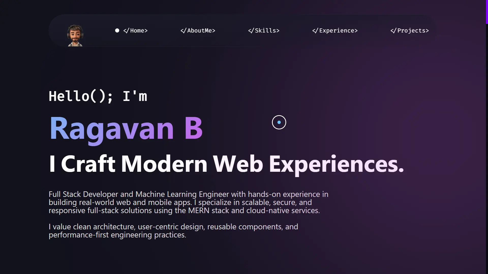

<div align="center">

# 🌐 Ragavan Developer – Portfolio  

**Live Preview →** 🔗 [ragavan-developer.web.app](https://ragavan-developer.web.app/)  
📌 This website showcases my **Projects, Web Presence, Story, Work Experience, and Contact Information.**

[](https://ragav7775.github.io/Ragavan-Portfolio/)
&nbsp;
[](https://ragavan-developer.web.app/)
&nbsp;
[](https://www.instagram.com/white_devil_00100)
&nbsp;
[](https://ragavan-developer.web.app/)
&nbsp;
<a href="https://github.com/Ragav7775/Ragavan-developer/blob/main/LICENSE" style="text-decoration:none;">
  
</a>

</div>

## 📸 Preview  



---

## 📂 Sections  

✔️ Mini Intro  
✔️ About Me  
✔️ Skills  
✔️ Projects  
✔️ Contact Me  

---

# ⚙️ Installation & Deployment  

## 1. Clone the Repository  

```bash
   git clone https://github.com/Ragav7775/Ragavan-developer.git
   cd Ragavan-developer
```

Modify the content of `index.html` as per your requirement.  

⚠️ Replace **my Bitmoji** in the navbar/footer with yours.  
⚠️ Update `<head>` with your own **Google Analytics ID & Search Console ID** (if needed).  

---

## 🛠️ Tools & Libraries  

- **GitHub Pages** – For static hosting  
- **Firebase Hosting** – For fast, secure deployment  
- **Animate On Scroll (AOS)** – Scroll animations  
- **Animista** – CSS animations  

---

## 🚀 Deploy via

- **Firebase Hosting**  
- **GitHub Pages**  
- **Netlify**  

---

## 📬 Contact  

💌 **Email:** <ragav.b369@gmail.com>  
📸 **Instagram:** [@white_devil_00100](https://instagram.com/white_devil_00100)  

---

## 📄 License  

This project is licensed under the **MIT License** – see the [LICENSE](LICENSE) file for details.  

---

⭐ **Star this repo if you like it** — it helps support my work!  

